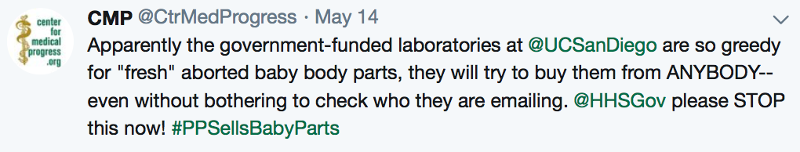

# Center for Medical Progress and UCSD

On May 14, 2019 the anti-abortion nonprofit [Center for Medical Progress](https://en.wikipedia.org/wiki/Center_for_Medical_Progress) (CMP) published a [tweet](https://twitter.com/CtrMedProgress/status/1128473861387902977) with a link to a PDF containing an email conversation
between CMP and a scientist at a UCSD genetics and genomics lab. The tweet
claims:

The tweet and emails have been cited in articles on pro-life news outlets [lifesitenews.com](https://www.lifesitenews.com/news/government-funded-laboratory-seeks-to-buy-baby-body-parts-from-almost-anyone)
and [liveaction.org](https://www.liveaction.org/news/university-lab-mistake-fetal-body-pro-life/).

After some digging into CMP's history, I now believe that CMP's
objective is a significant defunding of research at UCSD and that being
targeted by CMP is a threat to the health and safety of UCSD researchers. This
document outlines the evidence supporting that conclusion.

## A brief history of CMP

CMP was founded in 2013 by [long-time](http://www.rightwingwatch.org/post/the-radical-history-behind-the-center-for-medical-progress-sham-planned-parenthood-investigation/) pro-life activist [David Daleiden](https://en.wikipedia.org/wiki/David_Daleiden). It became widely known in the summer of 2015 after releasing [heavily edited
videos](https://en.wikipedia.org/wiki/David_Daleiden) of conversations with
[Planned Parenthood](https://www.google.com/url?sa=t&rct=j&q=&esrc=s&source=web&cd=22&cad=rja&uact=8&ved=2ahUKEwjB8qSou63iAhVjHTQIHQnWBF4QFjAVegQIAxAB&url=https%3A%2F%2Fen.wikipedia.org%2Fwiki%2FPlanned_Parenthood&usg=AOvVaw0TOcAkb6mBuSHyki2cPsUD) (PP) employees, and claiming ([falsely](https://www.mediamatters.org/blog/2015/12/17/misinformer-of-the-year-the-center-for-medical/207506)) that PP profited from
the sale of fetal tissue. Multiple legal conflicts between CMP and PP ensued,
including [15 felony charges](https://apnews.com/c50e993d047142cf8ca0e8050daf6114)
in 2017 (and still ongoing) by the State of California against Daleiden and CMP employee Sandra
Merritt, in addition to a [civil suit](https://www.courthousenews.com/anti-abortionist-cant-duck-planned-parenthood-lawsuit/) against CMP by PP.

### Aftermath of the Planned Parenthood controversy

The videos released by CMP had substantial scientific and political impact.
Legislation to end federal funding for PP was [proposed but not passed](https://www.reuters.com/article/us-usa-plannedparenthood/senate-blocks-planned-parenthood-defunding-measure-idUSKCN0Q80DL20150803) within months of the videos' release. Shortly thereafter, California-based fetal tissue
provider StemExpress [cut ties](https://www.latimes.com/business/hiltzik/la-fi-mh-a-partner-bails-on-planned-parenthood-20150817-column.html) with PP
under political pressure, [stymieing](https://web.archive.org/web/20161206191756/https://selectpaneldems-energycommerce.house.gov/sites/default/files/REVISED_FINAL_2.5.2016--ENTIRE%20REPORT-2.pdf)
research on various human disesases. CMP [targeted another provider](http://www.centerformedicalprogress.org/2018/09/cmp-issues-special-report-on-advanced-bioscience-resources/), Advanced
Bioscience Resources, in 2018.

## CMP's relationship with violent extremism

In late August 2015, Southern Poverty Law Center reported that CMP is [directly
connected](https://www.splcenter.org/hatewatch/2015/08/31/group-attacking-planned-parenthood-linked-extremists) to [Operation Rescue](https://en.wikipedia.org/wiki/Operation_Rescue_(Kansas)), another anti-abortion organisation whose members are
historically connected with violent extremism and domestic terrorism. Indeed,
a surge of reported threats against abortion providers followed the release of
CMP's videos.

On November 27, 2015, a [mass shooting](https://en.wikipedia.org/wiki/Colorado_Springs_Planned_Parenthood_shooting) occurred in a Planned Parenthood clinic
in Colorado Springs, Colorado, resulting in the deaths of three people and
injuries to nine. When the shooter was arrested, he reportedly ranted to police
about ["baby parts"](https://www.washingtonpost.com/politics/abortion-rights-groups-political-rhetoric-contributed-to-shooting/2015/11/29/d2fad2c4-96c7-11e5-8917-653b65c809eb_story.html?utm_term=.d8fa2e9453d3).

These facts demonstrate, at a minimum, that CMP's audience includes people
willing to perform acts of violence and terrorism in the name of pro-life
ideology.

